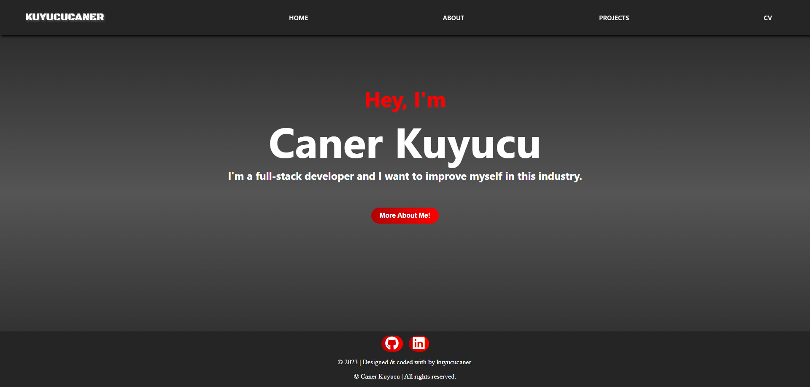
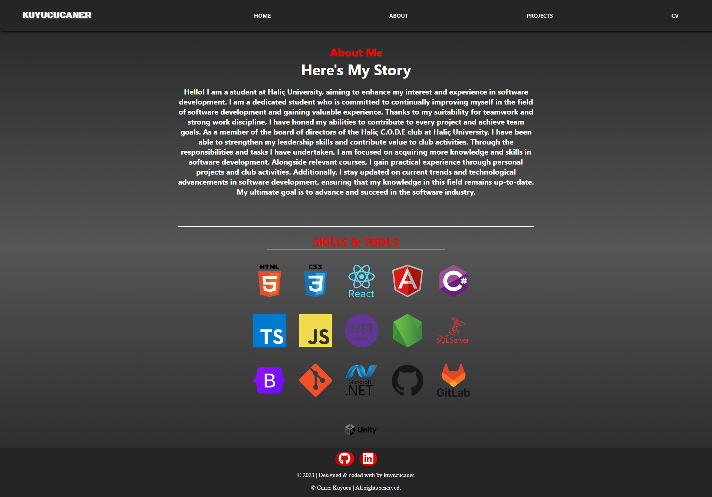
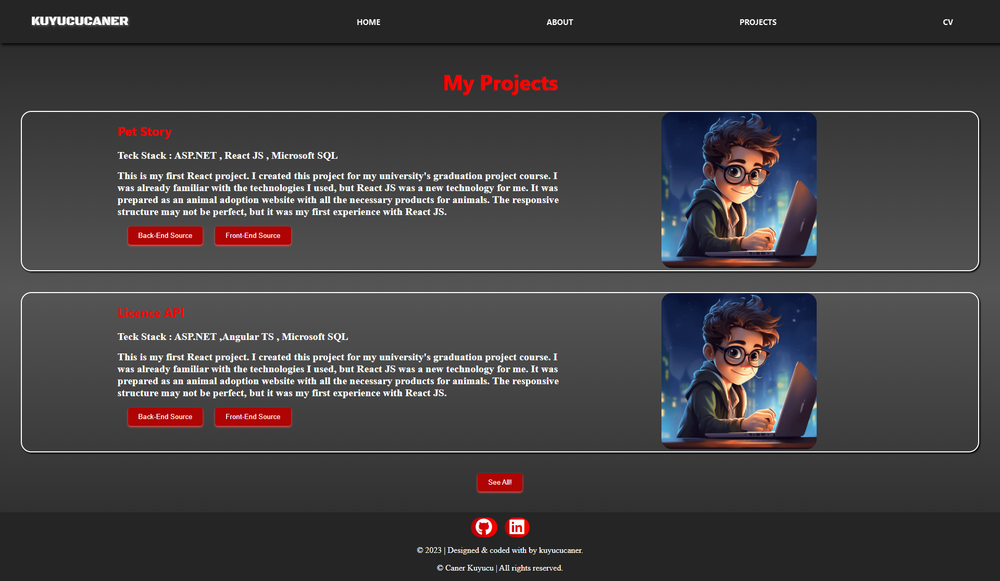
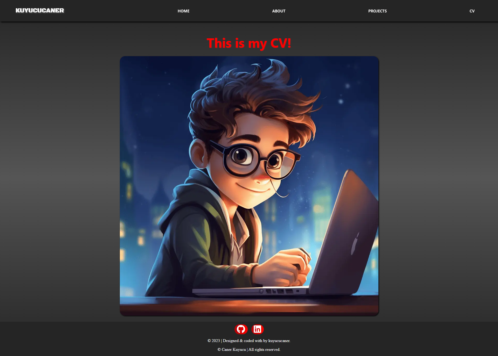

# 🌐 My Portfolio

**My Portfolio** is a personal portfolio website showcasing projects, skills, and contact information. It features a clean design with easy navigation between sections, allowing visitors to get to know the developer and their work. 

---

## 🎯 Purpose

- 🧑‍💻 Showcase personal and professional projects
- 🌍 Present skills and experience
- ✉️ Provide a contact option for collaboration or job opportunities

---

## 🚀 Features

- 📄 **About, Projects, and Contact Sections**
  - Navigate seamlessly between pages
- 🖼️ **Responsive Design**
  - Works well on desktops, tablets, and mobile devices
- 🎨 **Custom Styling**
  - Built with vanilla CSS for smooth visual presentation

---

## 🛠️ Tech Stack

| Layer         | Technologies   |
|---------------|----------------|
| Frontend      | HTML, CSS, JS  |
| Tools         | Git, GitHub, VS Code |

---









---
## 📦 Getting Started

Clone the repository and open the `index.html` file in your browser:

```bash
git clone https://github.com/kuyucucaner/My-Portfolio.git
cd My-Portfolio
